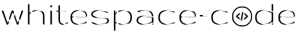

<!Logo>
    
     
<!Code information>
<!Last commit>
    
<!License>
    
<!Hits>
    
     
<!Jupyter>
    
<!Python>
    
    

<!Repository>
    

### About
Collection of daily puzzles/challenges from various sources and varying levels of technicality to practice and maintain coding skills. 
Feel free to attempt any or all 😄
### Sources
- <a href="https://codingbat.com/python">CodingBat</a> 
  <em>Basic code practice</em>
- <a href="https://py.checkio.org/">py.CheckiO</a> 
    <em>Python coding challenges from beginers to advance</em>
- <a href="https://adventofcode.com/">Advent of Code</a> 
    <em>Advent of Code is an Advent calendar of small programming puzzles for a variety of skill sets and skill levels that can be solved in any programming language you like.</em>

    <b>Note:</b> Click on the links to navigate to the respective source sites

